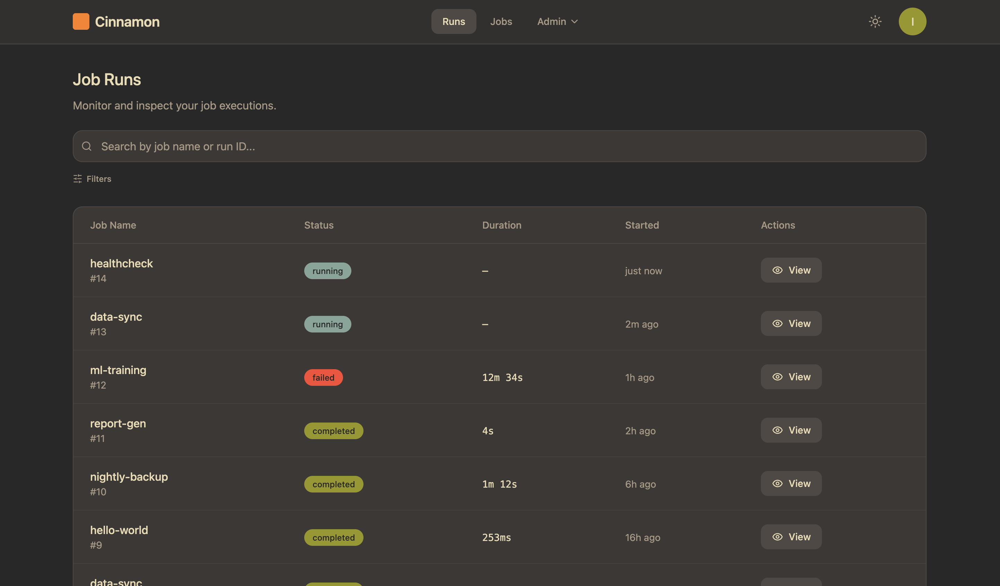
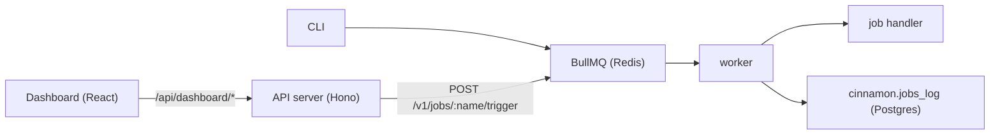

<p align="center">
  
</p>

<p align="center">
  Background job orchestration for your monorepo.<br/>
  Use GitHub Actions for deploys. Use Cinnamon for everything else.
</p>

<p align="center">
  <a href="https://opensource.org/licenses/MIT"></a>
  <a href="https://bun.sh"></a>
  <a href="https://www.docker.com"></a>
</p>

---

- **Config-driven** -- define jobs in `cinnamon.config.ts`, point them at any package in your monorepo
- **Language-agnostic** -- Python, Bash, Node, Bun, or any shell command
- **Scheduled + on-demand** -- cron expressions, CLI triggers, or HTTP API
- **Durable** -- every run logged to Postgres with stdout, stderr, timing, and structured results
- **Observable** -- built-in dashboard with live log streaming
- **Notifiable** -- Slack, Discord, or webhook alerts on success or failure

<p align="center">
  
</p>

## Quick start

Requires [Bun](https://bun.sh) and [Docker](https://www.docker.com/).

```bash
bun create cinnamon my-app
cd my-app
bun run dev
```

Open the dashboard at `http://localhost:3000`. See the [full setup guide](docs/project-structure.md#scripts) for `db:migrate`, `seed:team`, and CLI configuration.

## Add a job

Three steps: config, script, trigger.

**1. Define the job** in `cinnamon.config.ts`:

```typescript
import { defineConfig } from "./config/define-config.ts";

export default defineConfig({
  jobs: {
    "nightly-sync": {
      command: "bun",
      args: ["run", "sync"],
      cwd: "./packages/data",
      schedule: "0 2 * * *",
      timeout: "5m",
      description: "Sync data from upstream API",
      notifications: {
        on_failure: [{ url: "${DISCORD_WEBHOOK_URL}" }],
      },
    },
  },
});
```

Any command that runs in a shell works -- `python3`, `bash`, `bun`, `node`, `curl`, etc. Use `cwd` to target a specific package in your monorepo.

**2. Create the script** in your package:

```python
# jobs/nightly-sync/sync.py
import json

result = {"synced": 1420, "status": "ok"}
print(json.dumps(result))  # last JSON line → stored in jobs_log.result
```

**3. Trigger it:**

```bash
cinnamon trigger nightly-sync     # CLI
# or
curl -X POST http://localhost:3000/v1/jobs/nightly-sync/trigger \
  -H "Authorization: Bearer cin_<your_key>"
```

Jobs with a `schedule` field run automatically via cron. See [Jobs and config](docs/jobs.md) and [Writing scripts](docs/writing-scripts.md) for the full spec.

## Architecture



## Docs

| Topic | Description |
|-------|-------------|
| [API reference](docs/api.md) | Endpoints, query params, curl examples |
| [Jobs and config](docs/jobs.md) | Job definitions, `cinnamon.config.ts` |
| [Writing scripts](docs/writing-scripts.md) | Output contract for shell scripts |
| [Dashboard auth](docs/auth.md) | Google OAuth setup and session management |
| [Access requests](docs/access-requests.md) | Self-service access request flow |
| [Deployment](docs/deploy.md) | Docker Compose and CI/CD |
| [Migrations](docs/migrations.md) | Schema namespacing, migration patterns |
| [Project structure](docs/project-structure.md) | Directory layout, scripts, CLI |
| [Resilience](docs/resilience.md) | Zombie cleanup and worker self-healing |
| [Postgres](docs/postgres.md) | Health checks, SQL shell |
| [Redis](docs/redis.md) | Health checks, debugging |
| [Tests](docs/tests.md) | Test coverage and details |
| [Examples](examples/) | Reference implementations (Spotify, deploy configs) |

## Contributing

See [CONTRIBUTING.md](CONTRIBUTING.md) for development setup and guidelines.

## License

[MIT](LICENSE)
