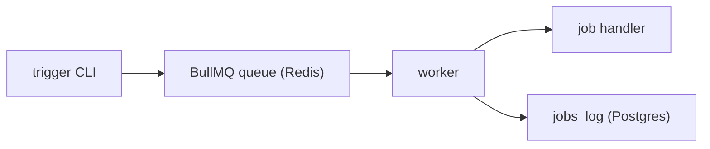

# cinnamon

Backend-first BullMQ demo where queued jobs are processed by a worker and logged to Postgres.

- Redis queue data auto-expires after 12 hours.
- Durable job history is stored in the `jobs_log` table.

## Architecture



1. **Trigger** (`src/index.ts`) parses CLI args and enqueues a named job via BullMQ.
2. **Worker** (`src/worker.ts`) picks up jobs, dispatches to registered handlers, and logs status to Postgres.
3. **Jobs** (`jobs/`) contain the actual logic. Each can also run standalone without the queue.

## Quick start

Requires Bun and Docker Compose.

1) Install dependencies:

```bash
bun install
```

2) Configure environment variables:

```bash
cp .env.example .env
```

3) Start services:

```bash
docker compose up -d postgres redis
```

4) Run database migrations:

```bash
bun run db:migrate
```

5) Run the worker (terminal 1):

```bash
bun run worker
```

6) Trigger a job (terminal 2):

```bash
bun run trigger cinnamon 10
```

Spotify recently played ingestion:

```bash
bun run trigger spotify-recently-played '{"dryRun":true}'
```

The scheduler (`src/scheduler.ts`) automatically enqueues repeatable jobs via BullMQ:

- `spotify-recently-played` — every hour
- `spotify-top-tracks` — daily (00:00 UTC)

Run locally with `bun run scheduler`, or deploy via Docker (see below).

## Project structure

```
config/           Environment and Redis connection config
db/
  connection.ts   Shared Postgres pool
  schema/         Drizzle table definitions
  migrations/     Generated SQL migrations
jobs/
  _shared/          Shared utilities for jobs (isDirectExecution)
  cinnamon/         Countdown demo job (leaf job)
  spotify/          Spotify job group
    auth.ts           Shared auth (token refresh, profile lookup)
    api.ts            Shared API client (fetchRecentlyPlayed, fetchTopTracks)
    types.ts          Shared Spotify types
    recently-played/  Ingest recently played tracks
    top-tracks/       Snapshot top tracks by time range
  registry.ts       Job name → handler mapping for the worker
scripts/          Dev tools (job runner, migration drop, DB reset)
src/
  index.ts        Trigger CLI entrypoint
  worker.ts       BullMQ worker process
  queue.ts        Queue configuration
  payload.ts      CLI payload parsing
  job-types.ts    Shared job type definitions
tests/            Unit tests
docs/             Ops documentation (Postgres, Redis, Spotify, tests)
```

<details>
<summary><strong>Scripts</strong></summary>

- `bun run clean` — remove `node_modules`.
- `bun run db:drop` — interactively drop the latest migration.
- `bun run db:generate` — generate a migration from schema changes.
- `bun run db:migrate` — apply pending Drizzle migrations.
- `bun run db:reset-local` — drop, recreate, and migrate local database.
- `bun run format` — apply Biome formatting.
- `bun run job` — interactive menu to run a local script from `jobs/`.
- `bun run job:cinnamon -- 5` — run `jobs/cinnamon.ts` directly from 5.
- `bun run job:dry` — interactive menu; requests dry-run mode for supported jobs.
- `bun run lint` — run Biome checks.
- `bun run lint:fix` — run Biome checks and auto-fix.
- `bun run test` — run test suite.
- `bun run trigger <job-name> [payload]` — enqueue a named BullMQ job.
- `bun run typecheck` — run TypeScript checks.
- `bun run scheduler` — register cron schedules and keep them alive.
- `bun run worker` — process queued jobs.

</details>

## Ops docs

- [Postgres checks](docs/postgres.md)
- [Redis checks](docs/redis.md)
- [Spotify OAuth](docs/spotify-auth.md)
- [Spotify recently played ingestion](docs/spotify-recently-played.md)
- [Tests guide](docs/tests.md)

## Docker deployment

Run the full stack (Postgres, Redis, worker, scheduler) with a single command:

```bash
cp .env.example .env   # then fill in Spotify credentials
docker compose up -d
```

This will:

1. Start Postgres and Redis
2. Run database migrations (one-shot `migrate` container)
3. Start the worker and scheduler

Monitor logs:

```bash
docker compose logs -f worker scheduler
```

Rebuild after code changes:

```bash
docker compose up -d --build
```

### Deploying to a remote machine

1. Install Docker and Docker Compose on the target machine.
2. Clone the repo and create `.env` from `.env.example`.
3. No changes needed for `DATABASE_URL` or `REDIS_URL` — `docker-compose.yml` overrides them to use internal container hostnames (`postgres`, `redis`).
4. Fill in `SPOTIFY_CLIENT_ID`, `SPOTIFY_CLIENT_SECRET`, and `SPOTIFY_REFRESH_TOKEN`.
5. Run `docker compose up -d`.

