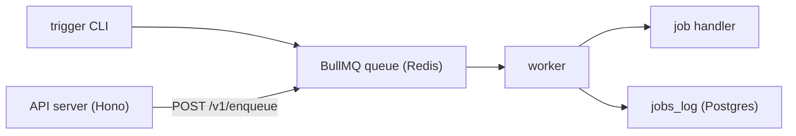

# cinnamon

Multi-tenant job orchestrator powered by BullMQ, Postgres, and Hono. Trigger jobs via CLI or a protected HTTP API.

- Language-agnostic: run Python, Bash, or any script via the shell job handler.
- Multi-tenant: teams and API keys isolate workloads per tenant.
- Durable: every job run is logged to the `jobs_log` table in Postgres.
- Redis queue data auto-expires after 12 hours.

## Architecture



1. **Trigger** (`src/index.ts`) parses CLI args and enqueues a named job via BullMQ.
2. **API server** (`src/server.ts`) exposes `POST /v1/enqueue` behind API key auth, pushing jobs into the same queue.
3. **Worker** (`src/worker.ts`) picks up jobs, dispatches to registered handlers, and logs status to Postgres.
4. **Jobs** (`jobs/`) contain the actual logic. Each can also run standalone without the queue.

## Quick start

Requires Bun and Docker Compose.

1) Install dependencies:

```bash
bun install
```

2) Configure environment variables:

```bash
cp .env.example .env
```

3) Start services:

```bash
docker compose up -d postgres redis
```

4) Run database migrations:

```bash
bun run db:migrate
```

5) Seed a default team and API key:

```bash
bun run scripts/seed-default-team.ts
```

Save the printed `cin_...` key — it won't be shown again.

6) Run the worker (terminal 1):

```bash
bun run worker
```

7) Trigger a job via CLI (terminal 2):

```bash
bun run trigger cinnamon 10
```

Or trigger via the HTTP API (terminal 2):

```bash
bun run server
```

```bash
curl -X POST http://localhost:3000/v1/enqueue \
  -H "Authorization: Bearer cin_<your_key>" \
  -H "Content-Type: application/json" \
  -d '{"jobName": "shell", "data": {"command": "echo", "args": ["hello"]}}'
```

### Shell jobs

Run any script or command through the `shell` job handler:

```bash
bun run trigger shell '{"command":"python3","args":["./jobs/shell/scripts/hello.py"]}'
```

Or via the API:

```bash
curl -X POST http://localhost:3000/v1/enqueue \
  -H "Authorization: Bearer cin_<your_key>" \
  -H "Content-Type: application/json" \
  -d '{"jobName": "shell", "data": {"command": "python3", "args": ["./jobs/shell/scripts/hello.py"]}}'
```

#### Structured JSON output

Scripts can return structured results by printing a JSON object on the last line of stdout. Set `parseJsonOutput: true` in the job payload to have the worker parse it:

```bash
curl -X POST http://localhost:3000/v1/enqueue \
  -H "Authorization: Bearer cin_<your_key>" \
  -H "Content-Type: application/json" \
  -d '{
    "jobName": "shell",
    "data": {
      "command": "python3",
      "args": ["./jobs/shell/scripts/example-json.py"],
      "parseJsonOutput": true
    }
  }'
```

The parsed object is saved to `jobs_log.result.parsed`. See [Writing scripts](docs/writing-scripts.md) for the full output contract.

### Spotify jobs

Spotify recently played ingestion:

```bash
bun run trigger spotify-recently-played '{"dryRun":true}'
```

The scheduler (`src/scheduler.ts`) automatically enqueues repeatable jobs via BullMQ:

- `spotify-recently-played` — every hour
- `spotify-top-tracks` — daily (00:00 UTC)

Run locally with `bun run scheduler`, or deploy via Docker (see below).

## API

The API server (`src/server.ts`) listens on `PORT` (default `3000`).

### Authentication

All `/v1/*` endpoints require a `Bearer` token in the `Authorization` header. The token is the plaintext API key generated by the seed script. The server hashes it with SHA-256 and looks it up in the `api_keys` table.

### Endpoints

| Method | Path           | Auth     | Description                  |
| ------ | -------------- | -------- | ---------------------------- |
| GET    | `/health`      | None     | Returns `{ "status": "ok" }` |
| POST   | `/v1/enqueue`  | Required | Enqueue a job                |

#### POST /v1/enqueue

Request body:

```json
{
  "jobName": "shell",
  "data": { "command": "echo", "args": ["hello"] }
}
```

- `jobName` (required) — must match a registered handler in `jobs/registry.ts`.
- `data` (optional) — arbitrary JSON payload forwarded to the job handler.

Response:

```json
{ "jobId": "12", "jobName": "shell" }
```

## Project structure

```
config/             Environment and Redis connection config
db/
  connection.ts     Shared Postgres pool
  schema/           Drizzle table definitions (jobs_log, teams, api_keys, spotify)
  migrations/       Generated SQL migrations
jobs/
  _shared/          Shared utilities for jobs (isDirectExecution)
  cinnamon/         Countdown demo job (leaf job)
  shell/            Shell/process executor (run any command/script)
    scripts/        Example scripts (hello.py)
  spotify/          Spotify job group
    auth.ts           Shared auth (token refresh, profile lookup)
    api.ts            Shared API client (fetchRecentlyPlayed, fetchTopTracks)
    types.ts          Shared Spotify types
    recently-played/  Ingest recently played tracks
    top-tracks/       Snapshot top tracks by time range
  registry.ts       Job name → handler mapping for the worker
scripts/            Dev tools (job runner, migration drop, DB reset, seed)
src/
  index.ts          Trigger CLI entrypoint
  server.ts         Hono HTTP API server
  worker.ts         BullMQ worker process
  queue.ts          Queue configuration
  auth.ts           API key verification (SHA-256 hash lookup)
  middleware/
    auth.ts         Bearer token auth middleware for Hono
  payload.ts        CLI payload parsing
  job-types.ts      Shared job type definitions
tests/              Unit and integration tests
docs/               Ops documentation (Postgres, Redis, Spotify, tests, deploy)
```

<details>
<summary><strong>Scripts</strong></summary>

- `bun run clean` — remove `node_modules`.
- `bun run db:drop` — interactively drop the latest migration.
- `bun run db:generate` — generate a migration from schema changes.
- `bun run db:migrate` — apply pending Drizzle migrations.
- `bun run db:reset-local` — drop, recreate, and migrate local database.
- `bun run format` — apply Biome formatting.
- `bun run job` — interactive menu to run a local script from `jobs/`.
- `bun run job:cinnamon -- 5` — run `jobs/cinnamon.ts` directly from 5.
- `bun run job:dry` — interactive menu; requests dry-run mode for supported jobs.
- `bun run lint` — run Biome checks.
- `bun run lint:fix` — run Biome checks and auto-fix.
- `bun run test` — run test suite.
- `bun run trigger <job-name> [payload]` — enqueue a named BullMQ job.
- `bun run typecheck` — run TypeScript checks.
- `bun run auth:spotify` — obtain a Spotify refresh token interactively.
- `bun run scheduler` — register cron schedules and keep them alive.
- `bun run server` — start the HTTP API server.
- `bun run worker` — process queued jobs.

</details>

## Ops docs

- [Postgres checks](docs/postgres.md)
- [Redis checks](docs/redis.md)
- [Spotify OAuth](docs/spotify-auth.md)
- [Spotify recently played ingestion](docs/spotify-recently-played.md)
- [Tests guide](docs/tests.md)
- [Deployment](docs/deploy.md)
- [Writing scripts](docs/writing-scripts.md)

## Docker deployment

Run the full stack (Postgres, Redis, worker, scheduler) with a single command:

```bash
cp .env.example .env   # then fill in Spotify credentials
docker compose up -d
```

This will:

1. Start Postgres and Redis
2. Run database migrations (one-shot `migrate` container)
3. Start the worker and scheduler

Monitor logs:

```bash
docker compose logs -f worker scheduler
```

Rebuild after code changes:

```bash
docker compose up -d --build
```

### Deploying to a remote machine

1. Install Docker and Docker Compose on the target machine.
2. Clone the repo and create `.env` from `.env.example`.
3. No changes needed for `DATABASE_URL` or `REDIS_URL` — `docker-compose.yml` overrides them to use internal container hostnames (`postgres`, `redis`).
4. Fill in `SPOTIFY_CLIENT_ID`, `SPOTIFY_CLIENT_SECRET`, and `SPOTIFY_REFRESH_TOKEN`.
5. Run `docker compose up -d`.
