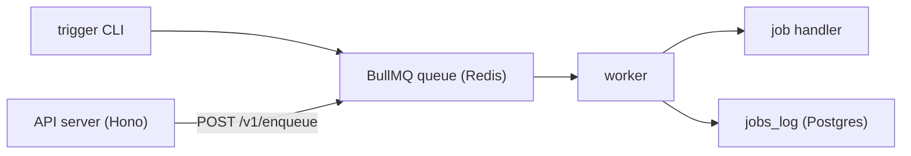

# cinnamon

Multi-tenant job orchestrator powered by BullMQ, Postgres, and Hono. Trigger jobs via CLI or a protected HTTP API.

- Language-agnostic: run Python, Bash, or any script via the shell job handler.
- Multi-tenant: teams and API keys isolate workloads per tenant.
- Durable: every job run is logged to the `jobs_log` table in Postgres.
- Observable: query job history, check schedules, and debug failures through the REST API.

## Architecture



## Quick start

Requires Bun and Docker Compose.

```bash
bun install                            # 1. install dependencies
cp .env.example .env                   # 2. configure environment
docker compose up -d postgres redis    # 3. start Postgres + Redis
bun run db:migrate                     # 4. run migrations
bun run scripts/seed-team.ts           # 5. create team + API key (save the cin_... key)
```

Then open two terminals:

```bash
bun run worker                         # terminal 1: process jobs
```

```bash
bun run server                         # terminal 2: start API server
```

Trigger a job via the API:

```bash
curl -s -X POST http://localhost:3000/v1/jobs/hello-world/trigger \
  -H "Authorization: Bearer cin_<your_key>" | jq
```

Check your job history:

```bash
curl -s http://localhost:3000/v1/jobs \
  -H "Authorization: Bearer cin_<your_key>" | jq
```

## Docs

- [API reference](docs/api.md) -- all endpoints, query params, and curl examples
- [Jobs and config](docs/jobs.md) -- shell jobs, `cinnamon.config.ts`, Spotify jobs
- [Writing scripts](docs/writing-scripts.md) -- output contract for shell job scripts
- [Project structure](docs/project-structure.md) -- directory layout, scripts, Docker deployment
- [Tests](docs/tests.md) -- test coverage and details
- [Deployment](docs/deploy.md) -- CI/CD and remote deployment
- [Postgres](docs/postgres.md) -- health checks, SQL shell, useful queries
- [Redis](docs/redis.md) -- health checks, debugging
- [Spotify OAuth](docs/spotify-auth.md) -- refresh token setup
- [Spotify ingestion](docs/spotify-recently-played.md) -- recently played job details
