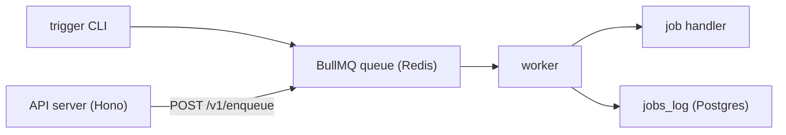

# cinnamon

Multi-tenant job orchestrator powered by BullMQ, Postgres, and Hono. Trigger jobs via CLI or a protected HTTP API.

- Language-agnostic: run Python, Bash, or any script via the shell job handler.
- Multi-tenant: teams and API keys isolate workloads per tenant.
- Durable: every job run is logged to the `jobs_log` table in Postgres.
- Observable: query job history, check schedules, and debug failures through the REST API.

## Architecture



## Quick start

Requires Bun and Docker Compose.

1. Install dependencies, configure env, and start infrastructure:

```bash
bun install
cp .env.example .env
docker compose up -d postgres redis
bun run db:migrate
```

2. Create a team and API key (save the `cin_...` key that's printed):

```bash
bun run scripts/seed-team.ts
```

3. Open two terminals — one for the worker, one for the API server:

```bash
bun run worker
```

```bash
bun run server
```

4. Set up the CLI (optional but recommended):

```bash
bun link
export PATH="$HOME/.bun/bin:$PATH"
cinnamon init   # enter your API URL and cin_... key
```

Trigger a job and check status:

```bash
cinnamon trigger hello-world
cinnamon status hello-world
cinnamon logs <job-id>
```

Or use curl directly:

```bash
curl -s -X POST http://localhost:3000/v1/jobs/hello-world/trigger \
  -H "Authorization: Bearer cin_<your_key>" | jq
```

## Docs

- [API reference](docs/api.md) -- all endpoints, query params, and curl examples
- [Jobs and config](docs/jobs.md) -- shell jobs, `cinnamon.config.ts`, Spotify jobs
- [Writing scripts](docs/writing-scripts.md) -- output contract for shell job scripts
- [Project structure](docs/project-structure.md) -- directory layout, scripts, CLI setup, Docker deployment
- [Tests](docs/tests.md) -- test coverage and details
- [Deployment](docs/deploy.md) -- CI/CD and remote deployment
- [Postgres](docs/postgres.md) -- health checks, SQL shell, useful queries
- [Redis](docs/redis.md) -- health checks, debugging
- [Spotify OAuth](docs/spotify-auth.md) -- refresh token setup
- [Spotify ingestion](docs/spotify-recently-played.md) -- recently played job details
