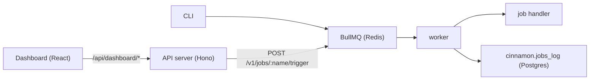

# cinnamon

A job orchestration framework powered by BullMQ, Postgres, and Hono. Define jobs in a config file, trigger them via CLI, HTTP API, or cron, and monitor everything through a built-in dashboard.

- **Language-agnostic** -- run Python, Bash, Node, or any command. If it runs in a shell, cinnamon can orchestrate it.
- **Multi-tenant** -- teams and API keys isolate workloads. Each job run is scoped to the team that triggered it.
- **Durable** -- every run is logged to Postgres with status, stdout, stderr, timing, and structured results.
- **Observable** -- query job history, inspect runs, check schedules, and stream live logs through the REST API or dashboard.
- **Notifiable** -- get Slack, Discord, or generic webhook notifications on job success or failure.

## Architecture



## Quick start

Requires [Bun](https://bun.sh) and Docker Compose.

1. Install dependencies, configure env, and start infrastructure:

```bash
bun install
cp .env.example .env
docker compose up -d postgres redis
bun run db:migrate
```

2. Create a team and API key (save the `cin_...` key that's printed):

```bash
bun run scripts/seed-team.ts
```

3. Open two terminals -- one for the worker, one for the API server + dashboard:

```bash
bun run worker
```

```bash
bun run dev
```

Starts API server (:3000) and Vite dashboard (:5173).

Open `http://localhost:5173/dashboard` to view the dashboard (with HMR).

4. Trigger a job:

```bash
cinnamon trigger hello-world
cinnamon status hello-world
```

Or use curl:

```bash
curl -s -X POST http://localhost:3000/v1/jobs/hello-world/trigger \
  -H "Authorization: Bearer cin_<your_key>" | jq
```

## How to add a job

Three steps: config, script, trigger.

**1. Define the job** in `cinnamon.config.ts`:

```typescript
export default defineConfig({
  jobs: {
    "my-job": {
      command: "python3",
      script: "./jobs/shell/scripts/my-script.py",
      timeout: "30s",
      description: "My custom job",
    },
  },
});
```

Any command that can run in a shell works -- `python3`, `bash`, `bun`, `node`, `curl`, etc.

**2. Create the script** at the path you specified:

```python
# jobs/shell/scripts/my-script.py
import json

result = {"processed": 42, "status": "ok"}
print(json.dumps(result))  # last line of JSON stdout → stored in jobs_log.result
```

**3. Trigger it:**

```bash
cinnamon trigger my-job              # via CLI
# or
curl -X POST http://localhost:3000/v1/jobs/my-job/trigger \
  -H "Authorization: Bearer cin_<your_key>"
```

Add a `schedule` field (cron syntax) to run it automatically:

```typescript
"my-job": {
  command: "python3",
  script: "./jobs/shell/scripts/my-script.py",
  timeout: "30s",
  schedule: "0 * * * *",  // every hour
},
```

See [Jobs and config](docs/jobs.md) and [Writing scripts](docs/writing-scripts.md) for the full spec.

## Notifications

Jobs can send webhooks on success or failure. Cinnamon auto-detects Discord and Slack URLs and formats messages accordingly; any other URL receives a generic JSON payload.

```typescript
"my-job": {
  command: "python3",
  script: "./jobs/shell/scripts/my-script.py",
  timeout: "30s",
  notifications: {
    on_failure: [{ url: "${DISCORD_WEBHOOK_URL}" }],
    on_success: [{ url: "${SLACK_WEBHOOK_URL}" }],
  },
},
```

`${VAR}` references are resolved from environment variables at runtime.

## Using as a submodule

Cinnamon is designed to be added as a git submodule inside your project. This keeps your jobs and config in your repo while pulling in the framework.

```bash
git submodule add https://github.com/<org>/cinnamon.git cinnamon
```

### Docker Compose merge

Use Docker Compose's [merge](https://docs.docker.com/compose/how-tos/multiple-compose-files/merge/) feature to layer your app on top of cinnamon's base services:

```bash
docker compose -f cinnamon/docker-compose.yml -f docker-compose.override.yml up -d
```

Your override file adds project-specific config (env vars, volumes, extra services) while inheriting Postgres, Redis, worker, scheduler, and API from cinnamon.

See [`examples/deploy/docker/`](examples/deploy/docker/) for a working override example.

### Migrations

Cinnamon tables live in a dedicated `cinnamon` Postgres schema, so they never collide with your app's tables. Run cinnamon's migrations separately from your own:

```bash
cd cinnamon && bun run cinnamon:migrate && cd ..
```

See [Migrations](docs/migrations.md) for the full dual-migration setup.

## Dashboard auth (optional)

The dashboard is open by default for local dev. To require Google sign-in:

1. Place your GCP OAuth `client_secret.json` in the project root (or set `GOOGLE_CLIENT_ID` / `GOOGLE_CLIENT_SECRET` in `.env`).
2. Generate a session secret and add it to `.env`:

```bash
bun run generate:secret
```

Paste the output as `SESSION_SECRET` in `.env`.

3. For local dev with `bun run dev` (Vite on port 5173), create `.env.local` with `BASE_URL=http://localhost:5173` so the OAuth callback and session cookie use the same origin. Keep `BASE_URL=http://localhost:3000` in `.env` for Docker/production. `.env.local` overrides `.env` when running locally and is gitignored.

4. Optionally restrict access to specific emails:

```
ALLOWED_EMAILS=you@gmail.com,teammate@gmail.com
```

When `SESSION_SECRET` is unset, auth is disabled and the dashboard remains open.

See `.env.example` for all options.

## Docs

- [API reference](docs/api.md) -- endpoints, query params, and curl examples
- [Jobs and config](docs/jobs.md) -- job definitions, `cinnamon.config.ts`
- [Writing scripts](docs/writing-scripts.md) -- output contract for shell scripts
- [Migrations](docs/migrations.md) -- schema namespacing, dual migration pattern
- [Project structure](docs/project-structure.md) -- directory layout, scripts, CLI
- [Deployment](docs/deploy.md) -- Docker Compose and CI/CD overview
- [Postgres](docs/postgres.md) -- health checks, SQL shell, queries
- [Redis](docs/redis.md) -- health checks, debugging
- [Tests](docs/tests.md) -- test coverage and details
- [Examples](examples/) -- reference implementations (Spotify integration, deploy configs)
